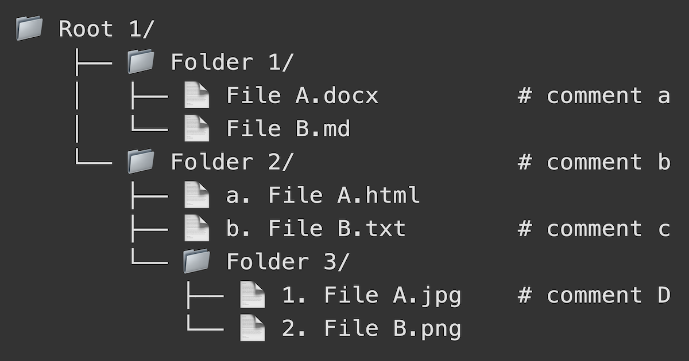

# treePhorge

An ASCII tree diagram and structure generator. Designed and tested for AI readability. 

## Input Methods

Create directory trees in two ways:

1. Regular Tree Format:

   Use indentation with two spaces per pathway; slashes are optional.

   ```
   Root/
     File1.txt
     Folder1/
       File2.md
       File3.html
   ```

2. Markdown Format:

   Paste or type a markdown outline; use headers and lists.

   ```
   # Root
   - File1.txt
   ## Folder1
   - File2.md
   - File3.html
   ```

### Comments & Metadata

Add comments to any folder or file using `#`. Comments will be auto-aligned in the final diagram. Each comment will be preserved during export as separate `..._comments.txt` files within the folder they belong:

```
Root/           # Main project folder
  src/          # Source code
    index.js    # Entry point
  README.md     # Documentation
```

## Theme Settings

- **Dark Mode:** Switch between light and dark themes for better visibility.
- **Preserve Ordering:** Should your folders and/or files have numbering or lettering as part of their outline, this toggle will preserve that list structure (e.g., "1. File.txt" or "a. File.txt").
- **Trailing Slash:** Toggle the trailing slash `/` after folder names.
- **Connected Roots:** Toggle the vertical pathway connecting the root folders.

## Display Settings

- **Folder Icons:** Show 📁 before folder names (non-ASCII emoji).
- **File Icons:** Show 📄 before file names (non-ASCII emoji).
- **All Caps:** Convert all names to uppercase.

## Format Settings

**Replace Spaces:** Choose how to handle spaces in file and folder names.

- **None:** Keep spaces as is (e.g., "my file.txt").
- **Underscore:** Replace spaces with the underscore `_` (e.g., "my_file.txt").
- **Dash:** Replace spaces with the dash `-` (e.g., "my-file.txt").
- **Remove:** Remove all white spaces (e.g., "myfile.txt").

**Export Format:** Choose how files are exported:

- **Text:** Export all files as text `.txt` files (default).
- **HTML:** Export all files as web `.html` files.
- **Markdown:** Export all files as markdown `.md` files.
- **Keep Original:** Preserve existing extensions; else `.txt` without extensions.

## Markdown Features

- Paste any markdown list or outline to convert it instantly.
- Headers (`#, ##, ###, ####, ####, #####, ######`) are converted to folders.
- List items (`-, *, +`) are converted to files.
- Numbered and lettered lists (`1., 2., a., b.`) are supported.
- Automatic conversion when you paste markdown.
- Markdown is converted as typed when `Enter` is pressed.
- Proper indentation is maintained based on header pathways.

## Export Features

- Files are exported in a `.zip` archive.
- Comments are saved as separate `..._comments.txt` files.
- The folder structure is preserved exactly as shown.
- File content is generated based on file type:
  - `.html` files include basic HTML structure
  - `.md` files include a title header
  - `.txt` files are created empty

## Tips

- Use the `Copy to Clipboard` button to share your diagram quickly.
- All settings are saved automatically between sessions.
- Theme settings are `ON` by default for better visualization.
- Display settings are `OFF` by default for cleaner output.
- You can also run this from your desktop; download the latest release and open the `index.html` in any browser.
